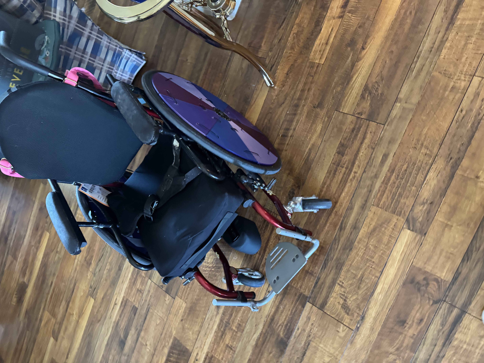
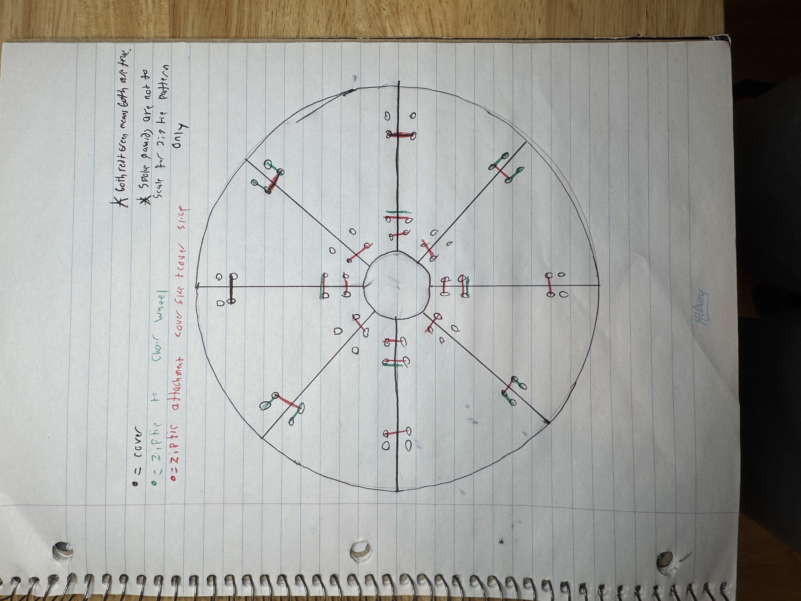
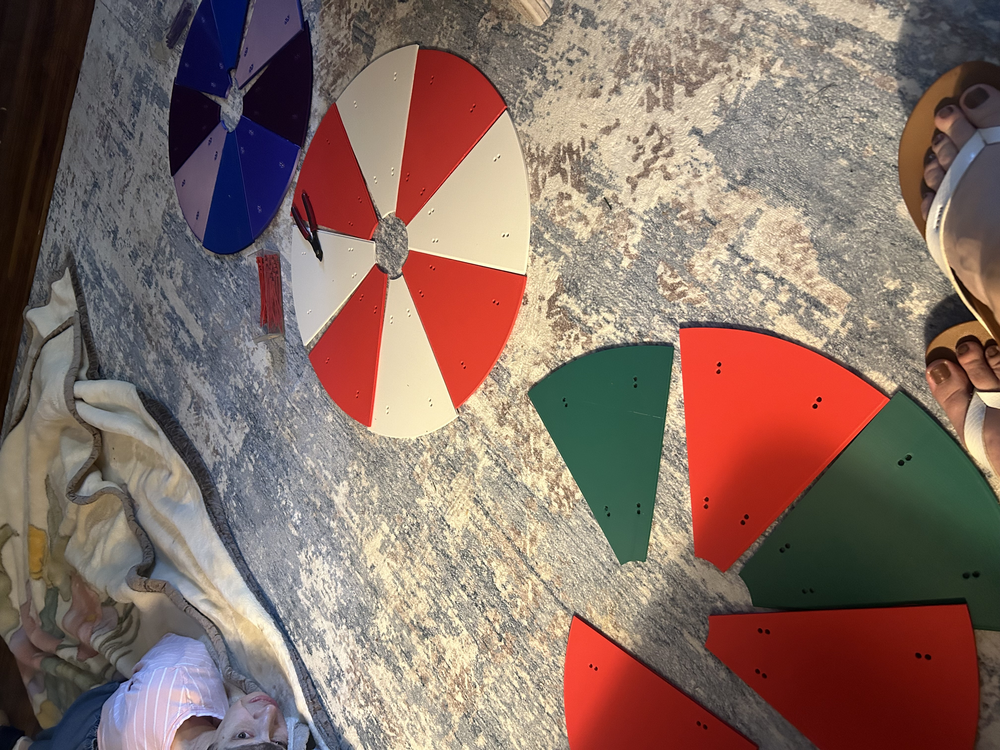

# Modular Customizable Wheelchair Covers

**A patent-pending, open-source spoke guard for manual and power wheelchairs.**
Print it on any consumer 3D printer. Assemble it with zip ties. Customize the colors however you want. It's free, and it will stay free.


---

## The story

This project exists because of my Aunt Laura.

Laura has severe cerebral palsy. She has lived her whole life with involuntary muscle movements that can drive her hand into the spokes of her wheelchair without warning. On one shopping trip, that's exactly what happened — she broke her finger.

We went looking for a fix. The commercial spoke guards we found were either too expensive, looked like clinical equipment, or weren't customizable enough for her to feel like *her*. Laura is a Texas Rangers fan. She likes to decorate for Christmas. None of the off-the-shelf options let her pick a color, let alone a pattern.

So I designed one for her, and then I designed it so anyone could print one for somebody they love.

I filed a US provisional patent with the USPTO on Thanksgiving week 2025 — not to make money, but to make sure **no company can ever patent this design first and then price it out of reach.** This repo is the public release: the CAD files, the drawings, the print settings, the assembly walkthrough, and the patent specification itself. Everything you need to make your own. Forever.

---

## What it is

A modular wheelchair drive-wheel cover that:

- **Prints in 8 pieces per wheel** — each segment spans about 45°, fits a 250 mm print bed, and a full set takes a single overnight print job on most printers.
- **Assembles with zip ties** — no glue, no special tools, no proprietary fasteners. About 30 standard 3 mm × 100 mm ties per wheel.
- **Uses a tongue-and-groove keyed seam** between segments to align panels and resist flex.
- **Fits common manual wheelchair wheels up to ~26"** (61 cm), with or without a hand rim.
- **Is fully customizable** — swap a single segment when it gets scuffed; print sets in team colors, holiday themes, or any pattern you want.
- **Is repairable** — break one panel, reprint one panel. No need to replace the whole cover.

| Installed | Side view | Routing schematic |
|---|---|---|
|  |  |  |

---

## Quick start

1. **Print** — 8 segments per wheel using the [STL](hardware/stl/Wheelchair-Spokeguard-Segment.stl) or open the [Fusion 360 source](hardware/cad/Wheelchair-Spokeguard.f3d) to scale it. See [docs/PRINT_SETTINGS.md](docs/PRINT_SETTINGS.md) for the recipe I use.
2. **Gather hardware** — a bag of cable ties (3 mm × 100 mm, ~30 per wheel) and flush cutters. See [docs/BOM.md](docs/BOM.md).
3. **Assemble** — clip the segments together using the tongue-and-groove seams and the seam apertures. Walkthrough in [docs/ASSEMBLY.md](docs/ASSEMBLY.md).
4. **Install** — zip-tie the assembled disc to the outboard side of the wheel, around the spokes or hand-rim posts. Walkthrough in [docs/INSTALLATION.md](docs/INSTALLATION.md).
5. **Customize** — paint, swap colors per segment, engrave a name. Ideas in [docs/CUSTOMIZATION.md](docs/CUSTOMIZATION.md).

Total cost per wheel, in mid-2026 USD: roughly **$3–6** in filament and **$2–3** in zip ties.

---

## Repo contents

```
.
├── README.md                          You are here
├── LICENSE                            CERN-OHL-S v2 (strong copyleft)
├── PATENTS.md                         Explicit royalty-free patent grant
├── NOTICE                             Attribution
├── CONTRIBUTING.md                    How to help
│
├── hardware/
│   ├── cad/Wheelchair-Spokeguard.f3d              Fusion 360 source (parametric)
│   ├── stl/Wheelchair-Spokeguard-Segment.stl      Ready-to-slice segment
│   └── drawings/
│       ├── Wheelchair-Spokeguard-Segment-Drawing.pdf
│       ├── Spoke-Connector-Drawing.pdf
│       └── Spoke-Cover-Assembly-Drawing.pdf
│
├── docs/
│   ├── ASSEMBLY.md                    Step-by-step segment assembly
│   ├── INSTALLATION.md                Mounting the disc on the wheel
│   ├── PRINT_SETTINGS.md              The print recipe that works for me
│   ├── BOM.md                         Hardware & material shopping list
│   ├── CUSTOMIZATION.md               Patterns, colors, ideas
│   └── patent/
│       ├── Modular-Segmented-Wheel-Cover-Patent-Spec.docx
│       └── Origin-and-Inventor-Statement.docx
│
└── images/
    ├── 01-installed-hero.jpg
    ├── 02-installed-side-view.jpg
    ├── 03-installed-detail.jpg
    ├── 04-ziptie-routing-schematic.jpg
    └── videos/
        ├── demo-1.mov
        └── demo-2.mov
```

---

## Color examples

Same eight-segment design, different palettes. Mix and match per segment to get whatever pattern you want — team colors, holiday themes, alternating stripes, or one-off panels with a name engraved.




---

## License and the patent

**Code, CAD, drawings, and documentation: [CERN-OHL-S v2](LICENSE)** — the strongly reciprocal open-hardware license. If you modify this design and distribute it (or products made with it), you must release your modifications under the same license. This is deliberate. The whole point of releasing this design is that nobody should ever be able to fence it off again.

**Patent: US provisional filed with the USPTO on November 27, 2025 by Adam Fabiano.** The patent is dedicated to the public under the terms in [PATENTS.md](PATENTS.md). In plain English:

- You can print, build, modify, share, sell, and remix this design royalty-free, as long as you do not weaponize patent rights against anyone else doing the same.
- The patent exists *only* to prevent a third party from patenting the design and locking it down.

If you want to fork this and sell prints to recover your time and filament cost — please do. Just don't try to lock the design away.

---

## Why the patent at all?

A common question: if you want this to be open, why patent it?

Because "open" without a defensive grant is fragile. A few months after a design becomes popular, a company can patent a near-identical version and send takedowns to every maker, Etsy seller, and disability nonprofit producing it. By being the first to file and then granting it to the public, this design is permanently in the commons. The patent is not a fence; it is the proof that there is no fence.

This is the same strategy used by Tesla's Open Patent Pledge and the [Open COVID Pledge](https://opencovidpledge.org), at a much smaller scale.

---

## Contributing

I welcome:

- **Remix forks** with different segment counts, wheel sizes, or seam profiles (please link back).
- **Pattern packs** — STL or texture files for decorated segments.
- **Translations** of the assembly guide.
- **Photos of yours installed** — open a "Show & Tell" issue. I'd love to see them.

See [CONTRIBUTING.md](CONTRIBUTING.md) for details.

---

## Built with Claude

Honest disclosure for anyone curious: I am 18 years old, and I used [Claude](https://claude.ai) for two specific things on this project:

- **Tightening the patent specification.** I drafted the invention; Claude helped me get the legal language into the right structure (Claims, Detailed Description, Best Mode) so the provisional filing was actually usable.
- **Drafting some of the technical-spec text** in this README and in `docs/PRINT_SETTINGS.md`.

Everything physical — the design decision to make it modular, the segment geometry, the tongue-and-groove seam, the zip-tie attachment method, the CAD in Fusion 360, the print testing on my own printer, and the working prototypes mounted on my aunt's chair — is mine. Claude was a writing collaborator, not the engineer.

---

## For Laura

For Laura, whose broken finger became this project. For wanting Texas Rangers colors instead of beige.

— Adam Fabiano, June 2026
